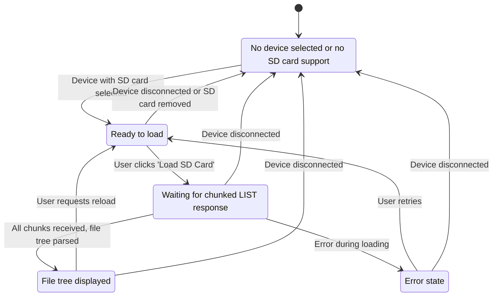

# SD Card View UI State Machine

## State Descriptions
- **NoDevice**: No device is selected, or the selected device does not support SD card operations. UI shows a message.
- **Idle**: Device is ready, but the SD card file tree is not loaded. UI shows a 'Load SD Card' button.
- **Loading**: The LIST command has been sent and the app is waiting for chunked BLE responses. UI shows a loading spinner/progress.
- **Loaded**: The file tree has been successfully loaded and is displayed in the UI.
- **Error**: An error occurred during loading or BLE communication. UI shows an error message and a retry option.

## Transitions
- User actions (button clicks) and device connection/disconnection events cause transitions between states.
- The UI should always reflect the current state explicitly.
